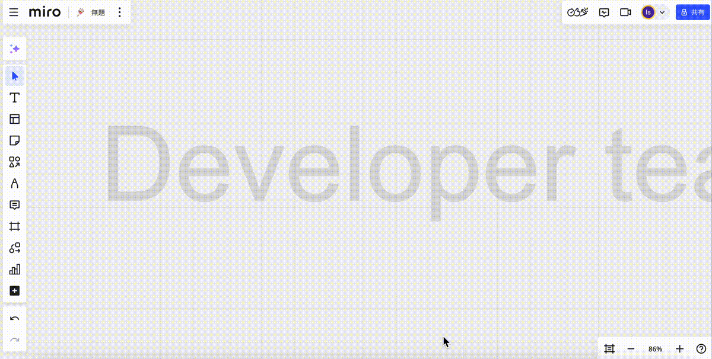

`Chart with Vega` allows you to create and edit graph images on your Miro board using Vega-Lite grammar.
Several simple Vega graph templates are provided. It is also possible to customize the Vega-Lite spec to create more complex graphs.

## Key Features:

- Add charts on your board
- Edit charts on your board

## How to use the App:

### Add a new chart

1. Click the `Chart with Vega` icon
1. Select a chart type
1. Click the Next button
1. Input data of the chart
1. (Optional) Edit the Vega-Lite specification
1. Click the Add button

### Edit an added chart

1. Select a chart on your board
1. Click the `Chart with Vega` icon
1. Modify the data or Vega-Lite specification
1. Click the Update button

## Third-Party Libraries

The app uses third-party libraries.See the [NOTICE](./NOTICE) file.

## Helpful Links

* [Privacy Policy](https://github.com/ihgs/chart_with_vega_docs/blob/main/PRIVACY_POLICY.md)
* [Terms of Service](https://github.com/ihgs/chart_with_vega_docs/blob/main/TERMS_OF_SERVICE.md)
* [Support](https://github.com/ihgs/chart_with_vega_docs/issues)