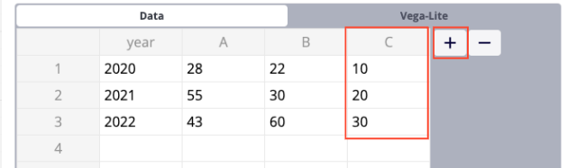
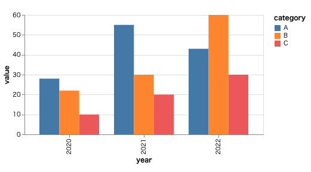
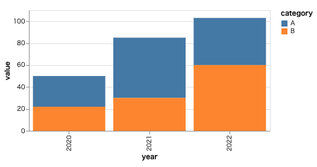
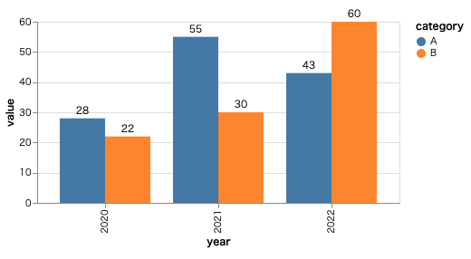
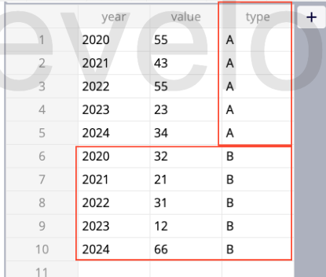
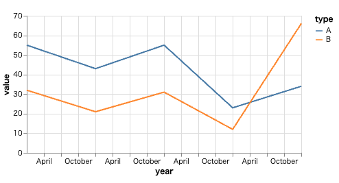
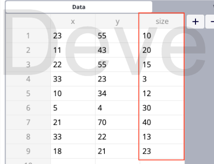
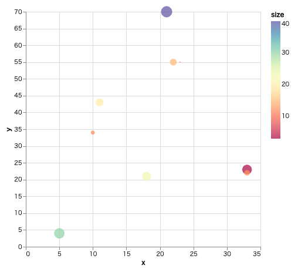
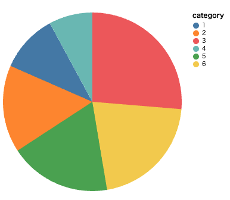

# Customizing Your Charts

Welcome to the customization guide for `Chart with Vega`.

## How to Use This Guide

In the sections below, you will find detailed instructions and examples on how to customize various types of charts. Each example includes a pre-defined Vega-Lite specification that you can use as a starting point. You can then follow the provided steps to make adjustments and create more complex or tailored visualizations.

Feel free to experiment with different settings and options to see how they affect your charts. Vega-Lite's concise and expressive syntax makes it easy to create a wide range of visualizations for data analysis and presentation.

For more detailed customization options, please refer to the [Vega-Lite documentation](https://vega.github.io/vega-lite/).

## Bar Chart

<details><summary>Pre-defined specification</summary>

```json
{
  "$schema": "https://vega.github.io/schema/vega-lite/v5.json",
  "description": "A simple bar chart data.",
  "width": 400,
  "height": 200,
  "data": {
    "values": "/** don't modify as it will be automatically inserted. **/"
  },
  "transform": [
    {
      "fold": [
        "A",
        "B"
      ],
      "as": [
        "category",
        "value"
      ]
    }
  ],
  "mark": "bar",
  "encoding": {
    "x": {
      "field": "year",
      "type": "nominal"
    },
    "y": {
      "field": "value",
      "type": "quantitative"
    },
    "xOffset": {
      "field": "category",
      "type": "nominal"
    },
    "color": {
      "field": "category",
      "type": "nominal"
    }
  }
}
```

</details>

### Adding a New category

* Add a column in Data panel

  
  
* Edit `fold` 

    ```diff
        {
            "fold": [
               "A",
    -          "B"
    +          "B",
    +          "C"
            ],
            "as": [
            "category",
    ```




### Stacked Bar Chart

* Remove `xOffset` 

    ```diff
        "y": {
        "field": "value",
        "type": "quantitative"
        },
    -   "xOffset": {
    -     "field": "category",
    -     "type": "nominal"
    -    },
        "color": {
        "field": "category",
        "type": "nominal"
        }
    }
    ```




### Bar Chart with Labels

* Use multi marks with layer

    ```diff
            ]
        }
        ],
    -    "mark": "bar",
    +    "layer": [
    +    {
    +      "mark": "bar"
    +    },
    +    {
    +      "mark": {
    +        "type": "text",
    +        "baseline": "bottom",
    +        "dy": -3,
    +        "fill": "black"
    +      },
    +      "encoding": {
    +        "text": {
    +            "field": "value",
    +            "type": "quantitative"
    +        }
    +      }
    +    }],
        "encoding": {
        "x": {
            "field": "year",
    ```



## Line Chart

<details><summary>Pre-defined specification</summary>

```json
{
  "$schema": "https://vega.github.io/schema/vega-lite/v5.json",
  "description": "A simple line chart.",
  "width": 400,
  "height": 200,
  "data": {
    "values": "/** don't modify as it will be automatically inserted. **/"
  },
  "mark": "line",
  "encoding": {
    "x": {
      "field": "year",
      "type": "temporal"
    },
    "y": {
      "field": "value",
      "type": "quantitative"
    }
  }
}
```

</details>

### Mulitple Lines

* Add a `type` column in Data panel and data with `type`

    

* Add `color`

    ```diff
        "y": {
            "field": "value",
            "type": "quantitative"
    +      },
    +      "color": {
    +        "field": "type"
        }
        }
    }
    ```




## Scatter Chart


<details><summary>Pre-defined specification</summary>

```json
{
  "$schema": "https://vega.github.io/schema/vega-lite/v5.json",
  "description": "A scatterplot showing horsepower and miles per gallons for various cars.",
  "data": {
    "values": "/** don't modify as it will be automatically inserted. **/"
  },
  "width": 400,
  "height": 400,
  "mark": "point",
  "encoding": {
    "x": {
      "field": "x",
      "type": "quantitative"
    },
    "y": {
      "field": "y",
      "type": "quantitative"
    }
  }
}
```

</details>

### Adding Size to Scatter Chart

* Add `size` column
    
  

* Change mark type and add `size` and `color`

  ```diff
      "width": 400,
      "height": 400,
  -    "mark": "point",
  +    "mark": "circle",
      "encoding": {
        "x": {
          "field": "x",
  @@ -15,6 +15,17 @@
        "y": {
          "field": "y",
          "type": "quantitative"
  +      },
  +      "size":{
  +        "field": "size",
  +        "legend": null
  +      },
  +      "color": {
  +        "field": "size",
  +        "type": "quantitative",
  +        "scale": {
  +          "scheme": "spectral"
  +        }
        }
      }
    }
  ```




## Pie chart


<details><summary>Pre-defined specification</summary>

```json
{
  "$schema": "https://vega.github.io/schema/vega-lite/v5.json",
  "description": "A simple pie chart with embedded data.",
  "width": 300,
  "height": 300,
  "data": {
    "values": "/** don't modify as it will be automatically inserted. **/"
  },
  "mark": "arc",
  "encoding": {
    "theta": {
      "field": "value",
      "type": "quantitative"
    },
    "color": {
      "field": "category",
      "type": "nominal"
    }
  }
}
```

</details>

### Sorted Pie chart

* Add `order`

  ```diff
        "color": {
          "field": "category",
          "type": "nominal"
  +      },
  +      "order": {
  +        "field": "value",
  +        "sort": "descending"
        }
      }
    }
  ```

